# Divide And Conquer

Have you ever had a large task on your hands that seemed too daunting to handle? Well, Divide And Conquer is here too help. Divide And Conquer is a productivity app that helps users divide large tasks called "main tasks" into much easier to complete "sub tasks."

Users start by creating a Main Task by hitting '+' in the top bar and hitting 'Add Main Task'

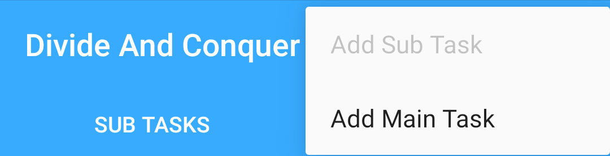

When adding/editing a main task, a user can enter in the name of the main task, assign a color to the task, and set a due date. No sub task's due date can exceed the due date of its main task.

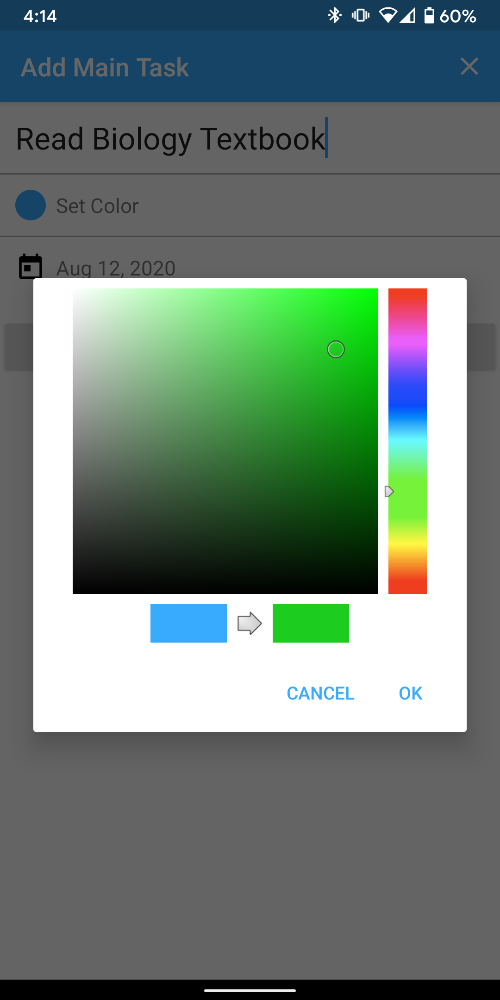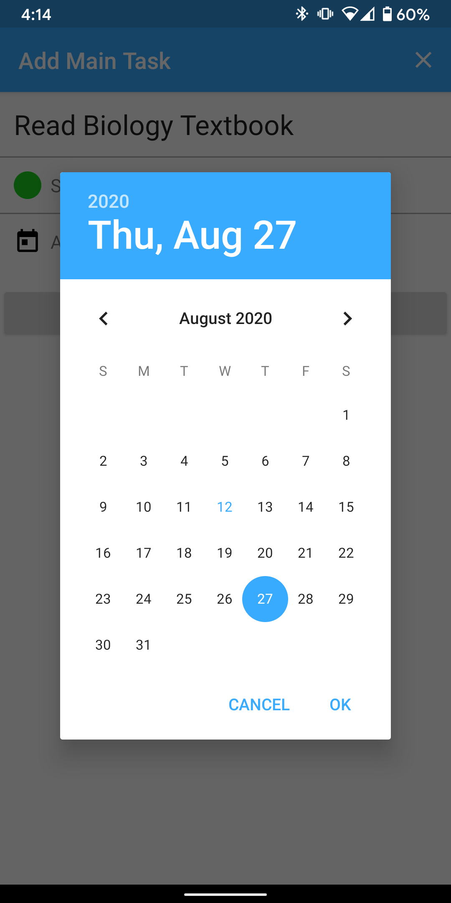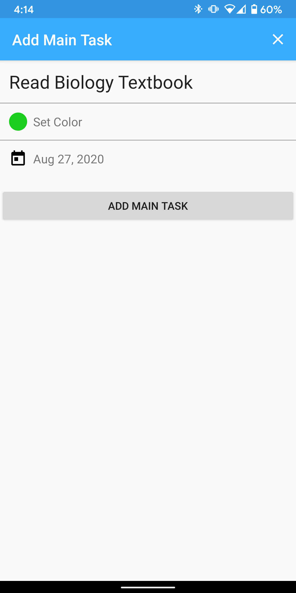

Once a main task has been creating, the user can start to create sub tasks. When adding/editing a sub task, the user can enter in the name of the sub task, select a nonoverdue main task, and select a due date.

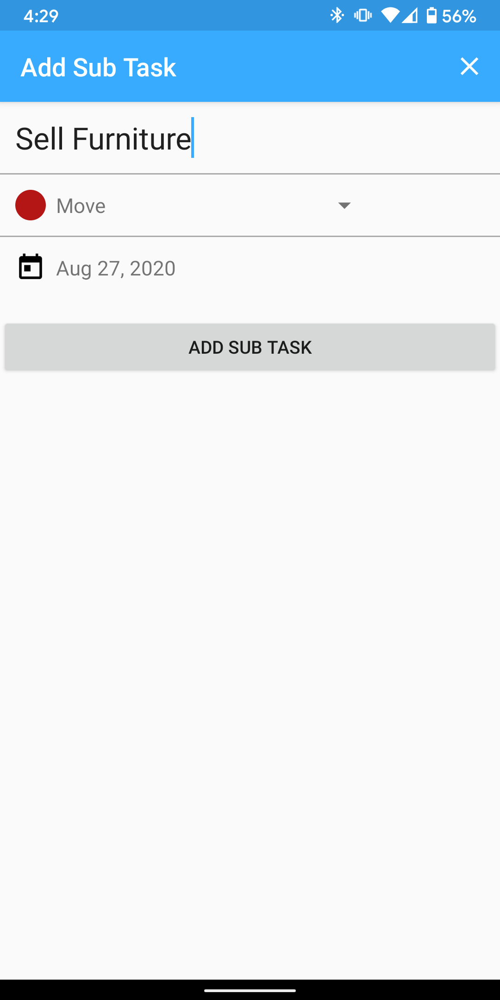

Users view their tasks on the main screen. To mark a sub task as complete, users simply hit the checkbox. Users can check the progress they are making on a main task by checking to see the percentage complete for each main task. Additionally, main tasks and sub tasks that are overdue are highlighted in red to warn the user.

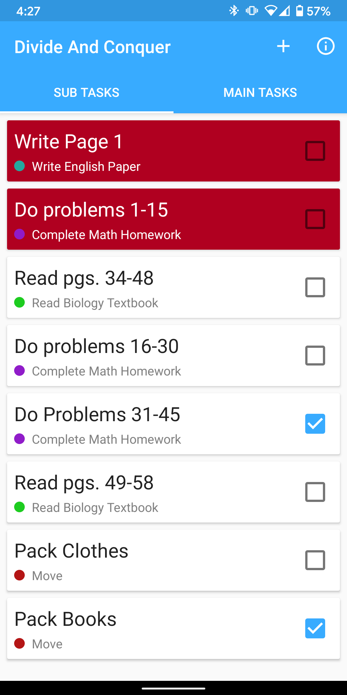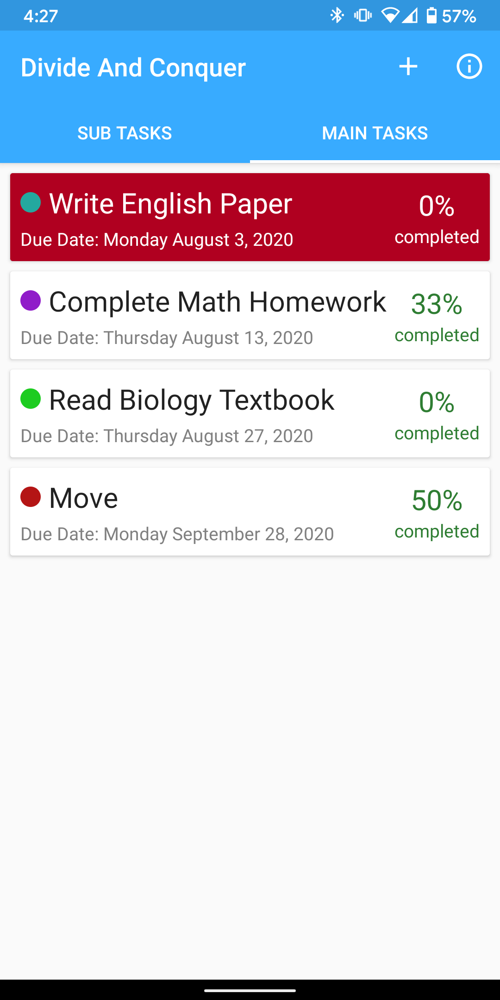

Users can view sub tasks for a specific main task simply by pressing on a main task on the main screen.

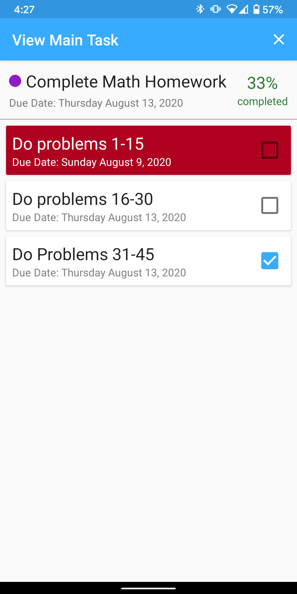

Users can edit main tasks and sub tasks by simply holding down the corresponding list item. Doing so brings them to the edit screen.

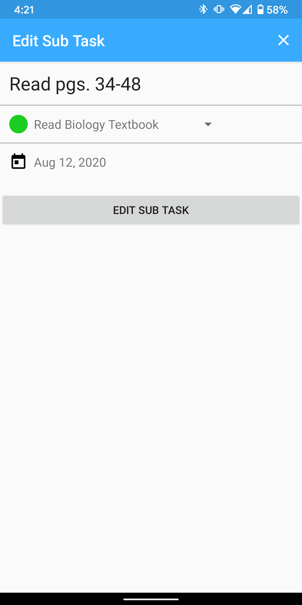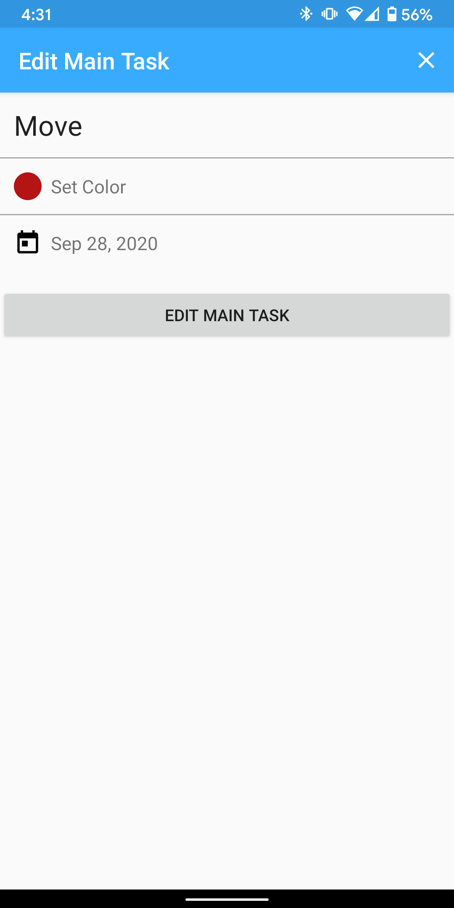

Users can also delete sub tasks simply by swiping to the right. Users can do the same for main tasks by swiping to the left. Deleting a main tasks also deletes all of its associated sub tasks.

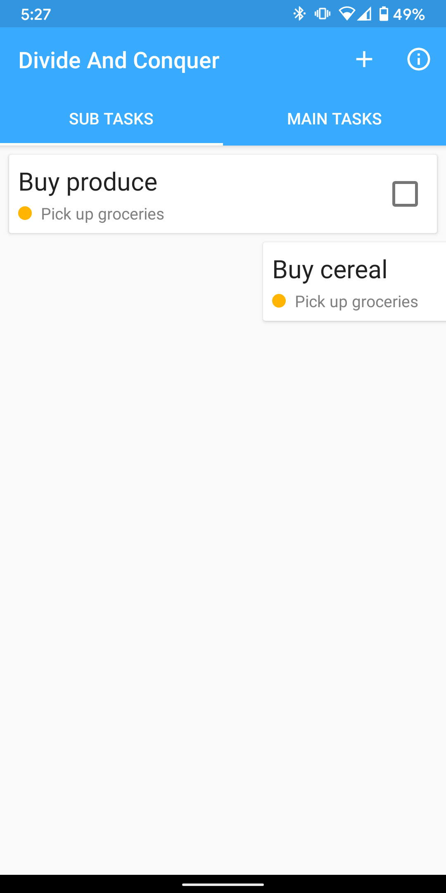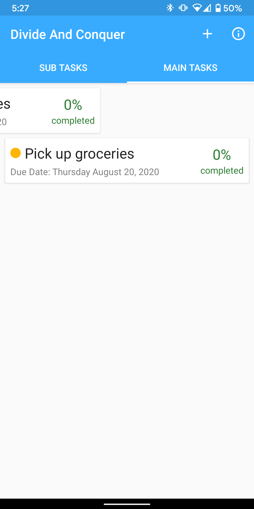
